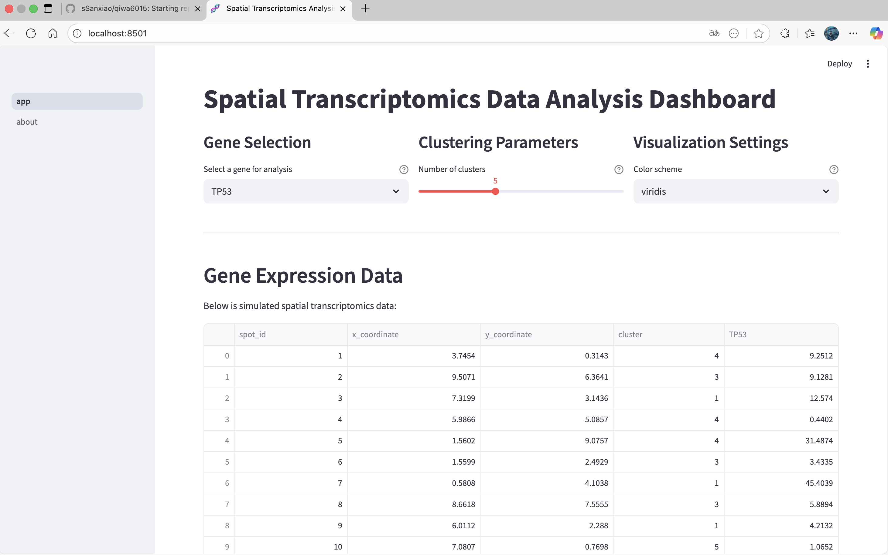
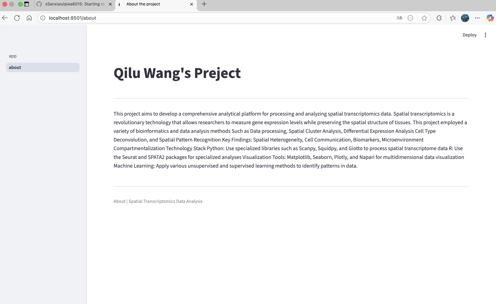

# PROHI Dashboard Example

**Author**: [Qilu Wang]

I was exempted for the DSHI course and credited, so I selected another project of mine for this assignment.

<!-- As main author, do not write anything in the line below.
The collaborator will edit the line below in GitHub -->
**Collaborator**: Patricia

_Note that this file is written in **MarkDown** language. A reference is available here: <https://www.markdownguide.org/basic-syntax/>_

_Here you can include images, like the logo from SU_


## Introduction

_This template project will contain a simple interactive web dashboard with Streamlit. Feel free to edit this document as desired_

## System description

### Installation of libraries

Run the commands below in a terminal to configure the project and install the package dependencies for the first time.

If you are using Mac, you may need to install Xcode. Check the official Streamlit documentation [here](https://docs.streamlit.io/get-started/installation/command-line#prerequisites).

1. Create the environment with `python -m venv env`
2. Activate the virtual environment for Python
   - [Linux/Mac] `source env/bin/activate` 
   - [Windows command prompt] `.\env\Scripts\activate.bat` 
   - [in Windows PowerShell] `.\env\Scripts\Activate.ps1`
3. Make sure that your terminal is in the environment (`env`) not in the global Python installation. The terminal should start with the word `env`
4. Install required packages `pip install -r ./requirements.txt`
5. Check that the installation works running `streamlit hello`
6. Stop the terminal by pressing **Ctrl+C**

### Execute custom Dashboard

First, make sure that you are running Python from the environment. Check the steps 2 and 3 above. Then, to run the custom dashboard execute the following command:

```
> streamlit run Dashboard.py
# If the command above fails, use:
> python -m streamlit run Dashboard.py
```

### Dependencies

Tested on Python 3.12.7 with the following packages:
  - Jupyter v1.1.1
  - Streamlit v1.46.1
  - Seaborn v0.13.2
  - Plotly v6.2.0
  - Scikit-Learn v1.7.0
  - shap v0.48.0

## Contributors

_Add the project's authors, contact information, and links to websites or portfolios._

Spatial Transcriptomics Data Analysis Platform

This is a web application built with Streamlit for analyzing and visualizing spatial transcriptomics data. The app consists of two main pages: the data dashboard and the about page.

Screenshots

Dashboard page


About page


Features

Dashboard page: Contains three input controls for gene selection, clustering parameter settings, 
and visualization options, along with a data table display and various visualization charts.

About page: Contains developer information and a summary of the spatial transcriptomics project.

Project Structure

qiwa6015/
|--app.py
|--pages/
   --about.py
|--requirements.txt
|--README.md
|--screenshots
   --Dashboard.png
   --About.png

Installation and Running

1: Clone repositories

git clone https://github.com/sSanxiao/qiwa6015.git
cd qiwa6015

2: Create a virtual environment

python3 -m venv spatial_env
source spatial_env/bin/activate

3: Install requirements

pip3 install -r requirements.txt

4: Run

streamlit run app.py


Developer: Qilu Wang(ID:sSanxiao)

Citations
If you use this code or are inspired by it, please cite:
Spatial Transcriptomics Data Analysis Platform. GitHub Repository. https://github.com/sSanxiao/qiwa6015

License
This project is licensed under the MIT License. See the LICENSE file for details.
